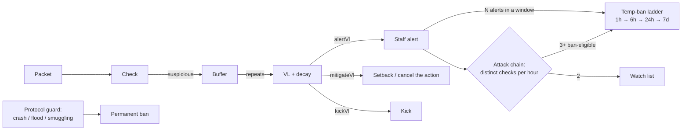

# BastionAC

<p><b>English</b> · <a href="README.ru.md">Русский</a> · <a href="../README.md">← Bastion</a></p>

A server-side anti-cheat engine for Fabric (Minecraft 1.21.11). It needs no client
mod. It started as a targeted answer to **Meteor** and its forks and grew into a
general engine; version 2.24 adds a full pass over **Wurst 7**, built from that
client's own source and defaults.

## Two principles

1. **Nothing is punished on one event.** Suspicious ticks fill a buffer, and the
   buffer feeds a violation level (VL) that decays over time. Only a pattern that
   keeps repeating crosses a threshold. False positives are kept out by design, not
   by hand-tuning.
2. **Check the outcome, not the signature.** A signature catches one
   implementation and breaks on the next; an outcome ("this player took no fall
   damage although vanilla had to charge it") catches all of them. Where it helps,
   both run side by side.

## Checks (38)

| Area | Checks |
|---|---|
| Movement | Speed · Fly · HighJump · BigMove · Timer · Blink · NoSlow · NoWeb · GroundSpoof · AntiHunger · NoFall (by packet *and* by outcome) · Spider · FastLadder · Jesus · Step · PacketOrder |
| Combat | Reach (lag-compensated against the victim's hitbox history) · Angle · Aim (exact hitbox-centre lock, flick-and-return) · Walls · MultiTarget · UseAttack · NoSwing · Criticals · Velocity · CPS · AutoTotem |
| World | FastBreak · FastPlace · Nuker · PacketMine · Scaffold · AirPlace · AutoPlace (computed face-centre clicks) · XRay (statistical, observe-only) |
| Rhythm | AutoClick · AutoAction — machine-even timing at human-plausible rates |
| Client & transport | Vehicle (BoatFly) · InvMove · BrandSpoof · GCD (aim grid) · BadRotation |
| Protocol guard | Packet flood · book/NBT bombs · creative-slot smuggling |

38 is the number of check types. HighJump, NoWeb, AntiHunger and FastLadder are signatures inside Fly, NoSlow, GroundSpoof and Spider. The protocol guard is a separate filter.

Some of these rest on facts rather than statistics:
- **PacketOrder** — since 1.21.2 the client closes every tick with
  `ClientTickEnd`, and a vanilla client sends at most one movement packet per tick.
- **Step** — the `+0.42 / +0.753` packet pair.
- **BadRotation** — a pitch beyond ±90°.
- **AutoPlace** — clicks at the exact geometric centre of a block face.

A vanilla client can produce none of these.

## From a flag to a ban



- Heuristic checks such as GCD, AutoClick and XRay are **observe-only**. They alert
  staff and never ban on their own.
- Operators are never auto-banned.
- The chain detector counts *different* checks, not points. One module cannot ban
  a player through the chain on its own.

## Tooling for staff

- **`/bac` panel.** A chest GUI with:
  - online players and their VLs;
  - alert and punishment history;
  - attack chains;
  - the network map of linked accounts;
  - in-game settings for every check.
- **Clickable alerts.** Hovering shows the check, details, coordinates and ping;
  clicking teleports you to the player.
- **Context buffer.** On the first alert, the packets that led up to it are frozen
  so they can be reviewed later.
- **Shadow telemetry.** Measures packet pressure and the cost of each check without
  ever acting on it.

## Build

```bash
./gradlew build   # JDK 21 → build/libs/bastionac-<version>.jar
./gradlew test    # 110 unit tests
```

The config is `config/bastionac/config.json`. It has per-check weight, alert,
mitigate and kick thresholds and decay. It migrates itself between schema versions
and never overwrites the admin's own tuning.

Full Russian documentation and version history: [`DETAILS.ru.md`](DETAILS.ru.md).
