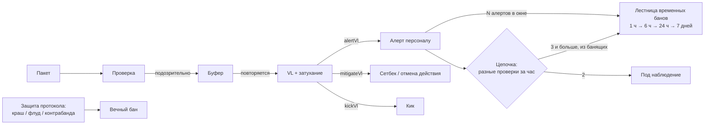

# BastionAC

<p><a href="README.md">English</a> · <b>Русский</b> · <a href="../README.ru.md">← Bastion</a></p>

Серверный античит для Fabric (Minecraft 1.21.11). Мод на клиенте не нужен.
Начинался как ответ на **Meteor** и его производные, потом вырос в общий движок.
В версии 2.24 полностью разобран **Wurst 7** — по исходникам и настройкам этого
клиента.

## Два принципа

1. **Ни одно событие не наказывается сразу.** Подозрительные тики копятся в
   буфере, буфер растит уровень нарушений (VL), а VL со временем затухает. Порог
   переходит только то, что стабильно повторяется. Ложные срабатывания отсечены
   устройством движка, а не подкруткой порогов.
2. **Проверять исход, а не сигнатуру.** Сигнатура ловит одну реализацию чита и
   ломается на следующей. Исход («игрок не получил урона от падения, хотя обязан
   был») ловит любую. Там, где это помогает, работают оба пути сразу.

## Проверки (38)

| Область | Проверки |
|---|---|
| Движение | Speed · Fly · HighJump · BigMove · Timer · Blink · NoSlow · NoWeb · GroundSpoof · AntiHunger · NoFall (по пакетам *и* по исходу) · Spider · FastLadder · Jesus · Step · PacketOrder |
| Бой | Reach (с лаг-компенсацией по истории хитбокса жертвы) · Angle · Aim (прицел точно в центр хитбокса, рывок и возврат взгляда) · Walls · MultiTarget · UseAttack · NoSwing · Criticals · Velocity · CPS · AutoTotem |
| Мир | FastBreak · FastPlace · Nuker · PacketMine · Scaffold · AirPlace · AutoPlace (вычисленные клики в центр грани) · XRay (статистика, только наблюдение) |
| Ритм | AutoClick · AutoAction — машинная ровность при «человеческой» частоте |
| Клиент и транспорт | Vehicle (BoatFly) · InvMove · BrandSpoof · GCD (сетка чувствительности мыши) · BadRotation |
| Защита протокола | флуд пакетами · книги-бомбы и NBT-бомбы · контрабанда предметов креативными пакетами |

38 — это число типов проверок. HighJump, NoWeb, AntiHunger и FastLadder — сигнатуры внутри Fly, NoSlow, GroundSpoof и Spider. Защита протокола — отдельный фильтр.

Часть проверок опирается на факты, а не на статистику:
- **PacketOrder** — с 1.21.2 клиент закрывает каждый тик пакетом
  `ClientTickEnd`, а обычный клиент шлёт не больше одного пакета движения за тик.
- **Step** — пара пакетов `+0.42 / +0.753`.
- **BadRotation** — наклон головы больше ±90°.
- **AutoPlace** — клик ровно в геометрический центр грани блока.

Обычный клиент ничего из этого сделать не может.

## Путь от флага до бана



- Эвристические проверки вроде GCD, AutoClick и XRay **только наблюдают**: они
  шлют алерт персоналу и сами никогда не банят.
- Операторов автобан не трогает.
- Цепочка считает *разные* проверки, а не очки. Один модуль чита не может
  довести игрока до бана через цепочку.

## Инструменты персонала

- **Панель `/bac`.** Меню-сундук, в нём:
  - игроки онлайн и их VL;
  - история алертов и наказаний;
  - цепочки нарушений;
  - сетевая карта связанных аккаунтов;
  - настройки каждой проверки прямо в игре.
- **Кликабельные алерты.** Наведение показывает проверку, детали, координаты и
  пинг; клик телепортирует к игроку.
- **Буфер контекста.** При первом алерте сохраняются пакеты, которые к нему
  привели, — их можно разобрать потом.
- **Теневая телеметрия.** Меряет нагрузку пакетами и стоимость проверок, но
  никогда ничего не делает сама.

## Сборка

```bash
./gradlew build   # JDK 21 → build/libs/bastionac-<версия>.jar
./gradlew test    # 110 юнит-тестов
```

Конфиг — `config/bastionac/config.json`. В нём у каждой проверки свой вес, пороги
алерта, противодействия и кика и скорость затухания. Конфиг сам переходит между
версиями схемы и никогда не затирает собственную настройку админа.

Полная документация и история версий: [`DETAILS.ru.md`](DETAILS.ru.md).
