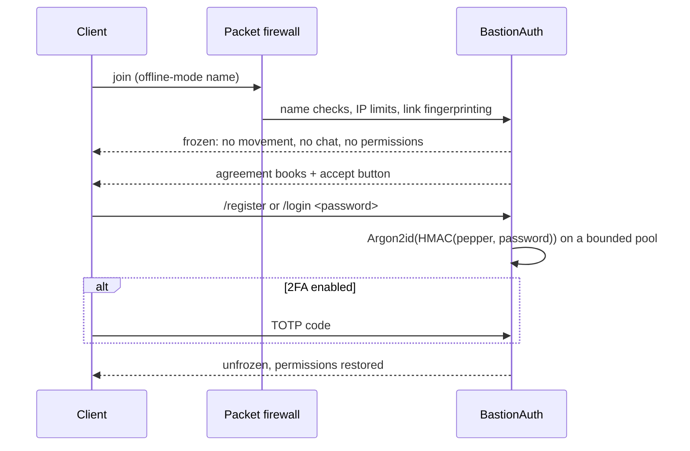

# BastionAuth

<p><b>English</b> · <a href="README.ru.md">Русский</a> · <a href="../README.md">← Bastion</a></p>

Hardened login and registration for **offline-mode** Fabric servers (Minecraft
1.21.11). In offline mode anyone can join under any name, so the server itself has to
prove who is who, and until it has, the connection must not be able to do anything.

## Highlights

**Cryptography**
- Passwords are hashed with **Argon2id** (BouncyCastle; 64 MiB, 3 iterations by
  default), each with its own salt.
- A **server pepper** is applied first: HMAC-SHA256 with `secret.key`. A stolen
  `auth.db` is useless without that file.
- Hashes are compared in constant time and stored in PHC format. They are re-hashed
  automatically when the parameters are raised.
- IP addresses are never stored in plain text: only an HMAC and a mask such as
  `1.2.*.*`.

**Frozen until login**
- **Packet firewall.** Before login, a whitelist on `ClientConnection.handlePacket`
  admits only the packets needed to type a password. Everything else is dropped
  before any vanilla handler sees it.
- **Permission freeze.** A frozen player has permission level 0, even with an
  operator's name. An impostor joining as an admin gets nothing, not even for one
  tick.
- The player cannot move (snap-back), is invisible and invulnerable, picks nothing
  up, sees no chat, and can run only `/login` and `/register`.

**Brute force and flood**
- Limits on failed logins per connection, per account (a lock that survives
  restarts) and per IP (sliding window).
- Limits on joins per IP per minute and on accounts per IP.
- Argon2 runs in a bounded pool, so a crowd of bots cannot eat the tick.

**Account security**
- **TOTP two-factor authentication.** The QR code is drawn on an in-game map item;
  backup codes are included; `/login <password> <code>` works in one line.
- **Code word.** Protects dangerous actions: password change, disabling 2FA, large
  transfers in other mods.
- **Account history, panic lock and new-device warnings.**
- **Name protection.** A strict regex; no case-variant squatting (`steve` vs
  `Steve`); a second connection from another IP is refused while the owner is online.
- **Session resume** bound to the last IP.
- **Agreement gate.** Server rules are handed out as books with an accept button. A
  separate timeout gives time to read them.

**Multi-account detection**
- Nine independent signals, scored together:
  - same device fingerprint;
  - same launcher UUID;
  - same client profile seen from another network;
  - same client mod channels;
  - same IP (HMAC);
  - similar names;
  - registration timing;
  - password reuse, compared by keyed fingerprints;
  - same typed server address.
- Grades: none, possible, likely, confirmed. Links are kept in a permanent ledger.
- Staff record their decisions on a pair with `/связи`: trusted, watch or
  multi-account.
- Other mods can ask `BastionAuth.accountsLinked(a, b)`.

## Login flow



## Commands

| Player | |
|---|---|
| `/register <pw> <pw>`, `/login <pw> [code]` | Register / log in |
| `/logout`, `/changepassword <old> <new> <new>` | Session and password |
| `/2fa` · `включить` · `подтвердить <code>` · `выключить <code>` · `коды <code>` | Two-factor authentication |
| `/слово` · `установить <word>` · `снять <word>` · `<word>` | Code word |
| `/auth история`, `/auth lock` | Account history, panic lock |

| Staff (op 3+, also from the console) | |
|---|---|
| `/auth status <name>`, `/auth links <name>`, `/auth stats` | Inspect accounts and links |
| `/auth unlock`, `/auth unregister`, `/auth 2fa reset <name>` | Recovery |
| `/связи [name]`, `/связи доверять\|наблюдать\|мульти\|сброс <a> <b>` | Account-link verdicts |
| `/auth reload` | Reload the config |

## Storage and configuration

- Accounts are stored in SQLite: `config/bastionauth/auth.db`.
- The pepper is in `config/bastionauth/secret.key`. Back it up: without it no
  password can be verified.
- All settings are in `config/bastionauth/config.json`. It reloads without a
  restart.
- The mod supports running behind BungeeCord or Velocity (see `DETAILS.ru.md`).

## Build

```bash
./gradlew build   # JDK 21 → build/libs/bastionauth-<version>.jar
./gradlew test    # 80 unit tests
```

The mod bundles BouncyCastle, sqlite-jdbc and ZXing. Fabric API is required on the
server.

Full Russian documentation and version history: [`DETAILS.ru.md`](DETAILS.ru.md).
