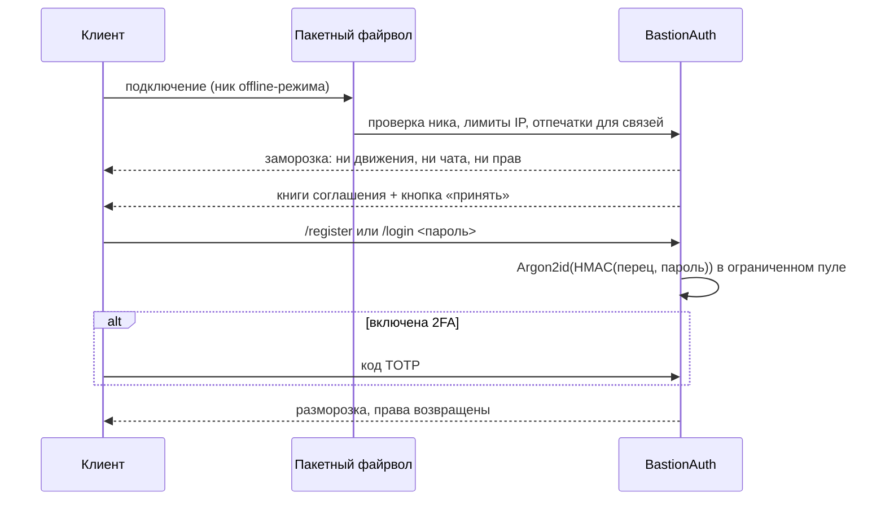

# BastionAuth

<p><a href="README.md">English</a> · <b>Русский</b> · <a href="../README.ru.md">← Bastion</a></p>

Защищённые вход и регистрация для **offline-серверов** на Fabric (Minecraft
1.21.11). В offline-режиме зайти можно под любым ником, поэтому сервер сам должен
установить, кто есть кто. А пока не установил, подключение не должно иметь
возможности сделать что-либо.

## Главное

**Криптография**
- Пароли хэшируются **Argon2id** (BouncyCastle; по умолчанию 64 МиБ и 3
  итерации), у каждого своя соль.
- Сначала применяется **серверный «перец»**: HMAC-SHA256 с ключом из
  `secret.key`. Украденный `auth.db` без этого файла бесполезен.
- Хэши сравниваются за постоянное время и хранятся в формате PHC. При повышении
  параметров они автоматически пересчитываются.
- IP-адреса не хранятся в открытом виде: только HMAC и маска вида `1.2.*.*`.

**Заморозка до входа**
- **Пакетный файрвол.** До входа белый список на `ClientConnection.handlePacket`
  пропускает только пакеты, нужные для ввода пароля. Всё остальное
  отбрасывается раньше, чем дойдёт до ванильного обработчика.
- **Заморозка прав.** У замороженного игрока уровень прав 0, даже если ник
  совпадает с ником оператора. Самозванец под ником админа не получает ничего —
  ни на один тик.
- Игрок не может двигаться (его возвращает на место), невидим и неуязвим, не
  подбирает предметы, не видит чат, и ему доступны только `/login` и `/register`.

**Перебор паролей и флуд**
- Лимиты неверных паролей на подключение, на аккаунт (блокировка переживает
  рестарт) и на IP (скользящее окно).
- Лимиты подключений с одного IP в минуту и аккаунтов с одного IP.
- Argon2 выполняется в ограниченном пуле, поэтому толпа ботов не съест TPS.

**Безопасность аккаунта**
- **Двухфакторная защита (TOTP).** QR-код рисуется на карте прямо в игре; есть
  резервные коды; `/login <пароль> <код>` работает одной строкой.
- **Кодовое слово.** Защищает опасные действия: смену пароля, отключение 2FA,
  крупные переводы в других модах.
- **История входов, «паника» и предупреждения о новом устройстве.**
- **Защита ников.** Строгий шаблон ника; занять чужой ник другим регистром
  (`steve` вместо `Steve`) нельзя; второе подключение с другого IP, пока хозяин
  онлайн, отклоняется.
- **Сессии** по последнему IP.
- **Соглашение.** Правила сервера выдаются книгами с кнопкой «принять». На
  чтение даётся отдельное время.

**Поиск твинков**
- Девять независимых сигналов, баллы складываются:
  - одинаковый отпечаток устройства;
  - одинаковый UUID лаунчера;
  - тот же профиль клиента из другой сети;
  - один набор модов клиента;
  - тот же IP (HMAC);
  - похожие ники;
  - время регистрации;
  - повтор пароля (сравниваются ключевые отпечатки);
  - тот же набранный адрес сервера.
- Оценки: нет, возможная, вероятная, подтверждённая. Связи хранятся в
  постоянном реестре.
- Решение по паре персонал выносит командой `/связи`: доверенная, под
  наблюдением или мультиаккаунт.
- Другие моды могут спросить `BastionAuth.accountsLinked(a, b)`.

## Как проходит вход



## Команды

| Игрок | |
|---|---|
| `/register <пароль> <пароль>`, `/login <пароль> [код]` | Регистрация и вход |
| `/logout`, `/changepassword <старый> <новый> <новый>` | Сессия и пароль |
| `/2fa` · `включить` · `подтвердить <код>` · `выключить <код>` · `коды <код>` | Двухфакторная защита |
| `/слово` · `установить <слово>` · `снять <слово>` · `<слово>` | Кодовое слово |
| `/auth история`, `/auth lock` | История аккаунта, «паника» |

| Персонал (OP 3+, работает и из консоли) | |
|---|---|
| `/auth status <ник>`, `/auth links <ник>`, `/auth stats` | Аккаунты и связи |
| `/auth unlock`, `/auth unregister`, `/auth 2fa reset <ник>` | Восстановление |
| `/связи [ник]`, `/связи доверять\|наблюдать\|мульти\|сброс <a> <b>` | Решения по связям |
| `/auth reload` | Перечитать конфиг |

## Хранение и настройки

- Аккаунты хранятся в SQLite: `config/bastionauth/auth.db`.
- «Перец» лежит в `config/bastionauth/secret.key`. Сделайте его копию: без него
  не проверить ни один пароль.
- Все настройки — в `config/bastionauth/config.json`, перечитываются без
  рестарта.
- Мод умеет работать за BungeeCord и Velocity (подробности в `DETAILS.ru.md`).

## Сборка

```bash
./gradlew build   # JDK 21 → build/libs/bastionauth-<версия>.jar
./gradlew test    # 80 юнит-тестов
```

Внутри мода — BouncyCastle, sqlite-jdbc и ZXing. На сервере нужен Fabric API.

Полная документация и история версий: [`DETAILS.ru.md`](DETAILS.ru.md).
