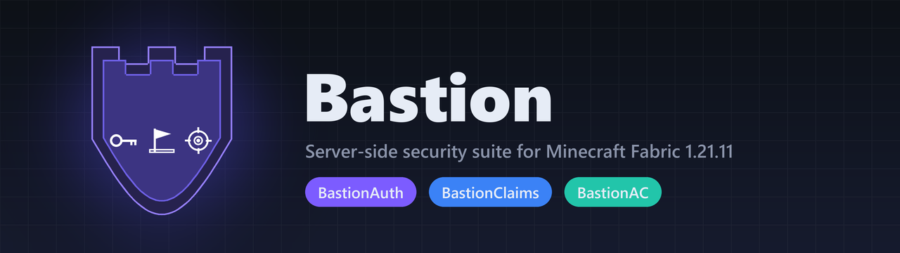
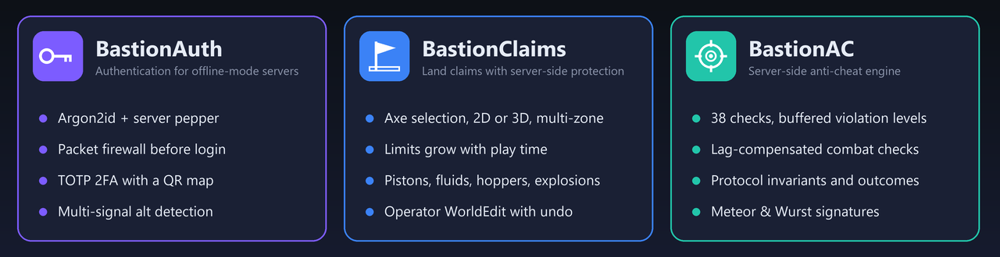
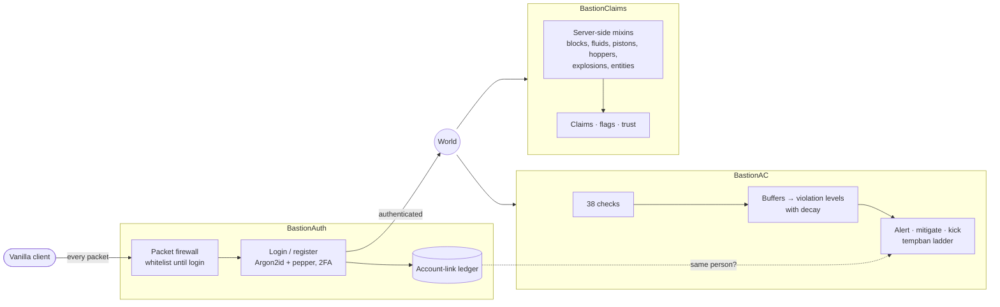

<p align="center">
  
</p>

<p align="center">
  
  
  
  
  
</p>

<p align="center"><b>English</b> · <a href="README.ru.md">Русский</a></p>

**Bastion** is a family of three server-side mods that protect an offline-mode
("cracked") Minecraft server: accounts, land and fair play. Everything runs on the
server — players join with an unmodified client and install nothing.

<p align="center"></p>

## Status

- **Built for Minecraft 1.21.11 on Fabric only.** No other game version or mod
  loader has been built or tested.
- **Running in production** on the MaxCora server: `MaxCore.mcje.in:36651`
  (Java Edition 1.21.11, any launcher). You are welcome to join and try to break it.
- **The published code can lag behind the live build.** For security reasons,
  updates reach this repository on a schedule and with a delay, so the server may run
  a newer and stronger build than the one published here.
- In-game texts are in Russian (the server's language). Code comments and this
  documentation are in English.

## Modules

| Module | Version | In one line |
|---|---|---|
| [**BastionAuth**](BastionAuth) | 1.8.3 | Login and registration for offline-mode servers: Argon2id with a server pepper, a packet firewall before login, TOTP 2FA, multi-account detection. |
| [**BastionClaims**](BastionClaims) | 1.17.4 | Land claims protected by server-side mixins, not only client callbacks: pistons, fluids, hoppers, explosions, projectiles. Also includes an operator WorldEdit with undo. |
| [**BastionAC**](BastionAC) | 2.24.0 | Anti-cheat engine: 38 checks, buffered violation levels with decay, lag-compensated combat, protocol invariants, Meteor and Wurst signatures. |

Each mod works on its own. When they run together, they talk through soft
reflection bridges: BastionAC reads BastionAuth's account-link ledger, and
BastionClaims honours a build mode provided by another mod. No mod has a hard
dependency on another.

## How they fit together



## Principles

- **Server authority.** Protection lives in server-side hooks and mixins, so a
  client that skips the vanilla code path cannot skip the protection.
- **Fail closed.** An unreadable claims file refuses to start instead of silently
  unprotecting the world. Credentials are never written in plain text.
- **Evidence over hunches.** The anti-cheat buffers every suspicion and punishes
  only what repeats. Checks prefer outcomes and protocol facts over client-specific
  signatures.
- **Explainable decisions.** `/claim why`, `/claim trace`, `/auth links` and the
  `/bac` panel say *why* something was allowed, refused or flagged.

## Building

Each module is a standalone Gradle project. You need JDK 21; the Gradle wrapper
downloads everything else.

```bash
cd BastionAC        # or BastionAuth / BastionClaims
./gradlew build     # → build/libs/<mod>-<version>.jar
```

To install, put the jar into the server's `mods/` folder next to
[Fabric API](https://modrinth.com/mod/fabric-api). Each mod writes its config to
`config/<mod>/` on first start.

## Tests

The repository has 236 unit tests: 80 in BastionAuth, 46 in BastionClaims and 110
in BastionAC. Run them with `./gradlew test` in a module folder. The anti-cheat
checks were also tested live with a raw-protocol client that sends the exact
packets of the cheat modules they target.

## Documentation

- Every module has an English overview (`README.md`) and a Russian one
  (`README.ru.md`).
- `DETAILS.ru.md` holds the full Russian documentation and the version history.

## License

[PolyForm Strict 1.0.0](LICENSE). You may read the code and use the mods for
noncommercial purposes. You may **not** distribute them, change them or publish
works based on them without the author's written permission. Please get in touch
if you need other terms.

## Author

[@dhehdjebejen-beep](https://github.com/dhehdjebejen-beep)
