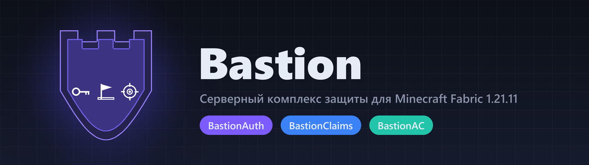
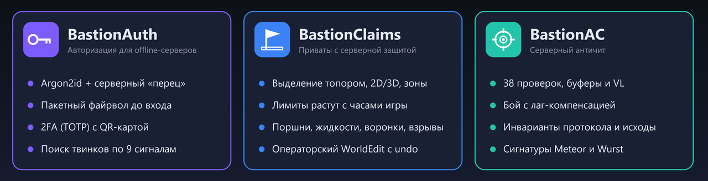
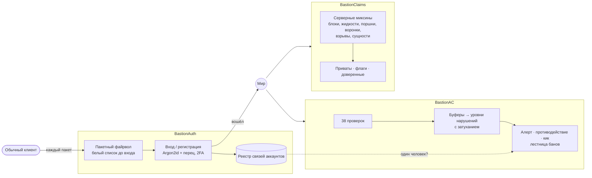

<p align="center">
  
</p>

<p align="center">
  
  
  
  
  
</p>

<p align="center"><a href="README.md">English</a> · <b>Русский</b></p>

**Bastion** — семейство из трёх серверных модов для защиты offline-сервера
Minecraft («пиратки»). Они защищают аккаунты, территорию и честность игры. Всё
работает на стороне сервера: игроки заходят с обычным клиентом и ничего не ставят.

<p align="center"></p>

## Статус

- **Сделано только под Minecraft 1.21.11 на Fabric.** Под другие версии игры и
  другие загрузчики моды не собирались и не проверялись.
- **Работает на живом сервере MaxCora:** `MaxCore.mcje.in:36651` (Java Edition
  1.21.11, подойдёт любой лаунчер). Заходите и попробуйте что-нибудь сломать.
- **Опубликованный код может отставать от серверной сборки.** Из соображений
  безопасности обновления попадают сюда по графику и с задержкой. На сервере может
  стоять более новая и мощная сборка, чем опубликованная здесь.
- Тексты в игре на русском (язык сервера). Комментарии в коде и документация на
  английском, у каждого мода есть README и на русском.

## Модули

| Мод | Версия | Коротко |
|---|---|---|
| [**BastionAuth**](BastionAuth) | 1.8.3 | Вход и регистрация на offline-сервере: Argon2id с серверным «перцем», пакетный файрвол до входа, 2FA (TOTP), поиск твинков. |
| [**BastionClaims**](BastionClaims) | 1.17.4 | Приваты, защищённые серверными миксинами, а не только клиентскими событиями: поршни, жидкости, воронки, взрывы, снаряды. Есть операторский WorldEdit с отменой. |
| [**BastionAC**](BastionAC) | 2.24.0 | Античит: 38 проверок, буферы нарушений с затуханием, бой с лаг-компенсацией, инварианты протокола, сигнатуры Meteor и Wurst. |

Каждый мод работает сам по себе. Вместе они общаются через мягкие мосты на
рефлексии: BastionAC читает реестр связей аккаунтов из BastionAuth, BastionClaims
учитывает режим стройки другого мода. Жёстких зависимостей между модами нет.

## Как это устроено



## Принципы

- **Решает сервер.** Защита стоит в серверных хуках и миксинах. Клиент, который
  обходит ванильный путь, не обходит защиту.
- **Отказ по умолчанию.** Нечитаемый файл приватов не даёт моду стартовать, а не
  открывает весь мир. Пароли и IP нигде не хранятся в открытом виде.
- **Доказательства, а не догадки.** Античит копит каждое подозрение и наказывает
  только за то, что повторяется. Проверки опираются на исход и на факты протокола,
  а не на сигнатуру конкретного клиента.
- **Решения объяснимы.** `/claim why`, `/claim trace`, `/auth links` и панель
  `/bac` показывают, *почему* действие разрешено, запрещено или помечено.

## Сборка

Каждый мод — отдельный Gradle-проект. Нужен JDK 21, остальное скачает Gradle
wrapper.

```bash
cd BastionAC        # или BastionAuth / BastionClaims
./gradlew build     # → build/libs/<мод>-<версия>.jar
```

Для установки положите jar в папку `mods/` сервера рядом с
[Fabric API](https://modrinth.com/mod/fabric-api). При первом запуске каждый мод
создаст конфиг в `config/<мод>/`.

## Тесты

В репозитории 236 юнит-тестов: 80 в BastionAuth, 46 в BastionClaims и 110 в
BastionAC. Запуск — `./gradlew test` в папке мода. Проверки античита, кроме того,
прогонялись вживую тестовым клиентом, который шлёт ровно те пакеты, что и модули
читов.

## Документация

- У каждого мода есть обзор на английском (`README.md`) и на русском
  (`README.ru.md`).
- `DETAILS.ru.md` — полная документация на русском и история версий.

## Лицензия

[PolyForm Strict 1.0.0](LICENSE). Код можно читать, а моды — использовать в
некоммерческих целях. Распространять их, изменять или публиковать работы на их
основе **нельзя** без письменного разрешения автора. Если нужны другие условия,
напишите автору.

## Автор

[@dhehdjebejen-beep](https://github.com/dhehdjebejen-beep)
